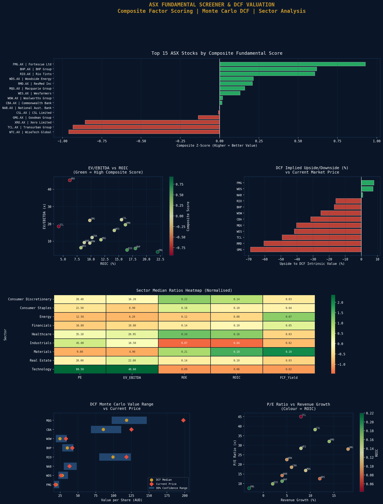

# ASX Fundamental Screener with DCF Valuation

A systematic fundamental analysis engine for ASX-listed companies combining multi-factor ratio screening, composite scoring, and Monte Carlo DCF valuation.

## Universe & Methodology
- **Stocks Screened:** 15 major ASX 200 companies across 7 sectors
- **DCF Valuations Run:** 15
- **Valuation Method:** 3-stage DCF with Monte Carlo simulation (1,000 scenarios)
- **Risk-Free Rate:** RBA 10-year bond yield (4.35%)
- **Equity Risk Premium:** 6.5% (Australian market)
- **Terminal Growth Rate:** 2.5% (RBA inflation target)
- **Data Source:** Financial Modeling Prep API + hardcoded fundamentals

## Universe Statistics
| Metric | Value |
|---|---|
| Median PE Ratio | 22.5x |
| Median EV/EBITDA | 12.1x |
| Median ROIC | 10.2% |

## Top 5 by Composite Fundamental Score
| Rank | Ticker | Company | Score | PE | ROIC |
|---|---|---|---|---|---|
| 1 | FMG.AX | Fortescue Ltd | 0.93 | 7.5x | 22.0% |
| 2 | BHP.AX | BHP Group | 0.62 | 11.2x | 18.0% |
| 3 | RIO.AX | Rio Tinto | 0.61 | 9.8x | 16.5% |
| 4 | WDS.AX | Woodside Energy | 0.21 | 12.5x | 8.2% |
| 5 | RMD.AX | ResMed Inc | 0.21 | 32.0x | 16.2% |

## Top 5 by DCF Implied Upside
| Ticker | Current Price | DCF Value | Upside | WACC |
|---|---|---|---|---|
| FMG.AX | $18.00 | $19.42 | +7.9% | 12.5% |
| WDS.AX | $26.00 | $27.87 | +7.2% | 10.1% |
| NAB.AX | $38.00 | $38.31 | +0.8% | 10.8% |
| RIO.AX | $118.00 | $99.19 | -15.9% | 11.2% |
| BHP.AX | $42.00 | $34.90 | -16.9% | 11.5% |

## Notes on Results
The composite score strongly favours Australian resource companies (FMG, BHP, RIO) due to their low PE ratios and high ROIC relative to the broader market. Technology names (XRO, WTC) score poorly on value metrics despite strong growth - consistent with a growth vs value framework. The DCF model uses conservative free cash flow estimates and RBA-based WACC, which naturally produces tighter implied upsides than consensus analyst targets.

## Visualisations

## Tools & Libraries
- Python 3
- requests (FMP API)
- pandas / numpy
- matplotlib / seaborn
- scipy
- yfinance

## Files
- `Project_3_ASX_Fundamental_Screener.ipynb` - Full Colab notebook
- `asx_fundamental_screener.png` - Screening dashboard

## Key Concepts Demonstrated
- Multi-factor composite scoring with z-score normalisation
- Three-stage DCF model construction
- WACC derivation using CAPM and RBA risk-free rate
- Monte Carlo sensitivity analysis on growth and discount rates
- Sector-relative valuation (EV/EBITDA heatmap)
- Value vs growth framework in Australian equities

## Relevance to Australian Finance Industry
Fundamental screening and DCF modelling are core skills at Australian equity research houses including Macquarie Research, UBS, and Citi. Long-only managers such as Magellan, Hyperion, and Platinum Asset Management use systematic ratio screens to generate investment ideas before deep-dive analysis. This project automates and systematises that workflow across the ASX 200.
